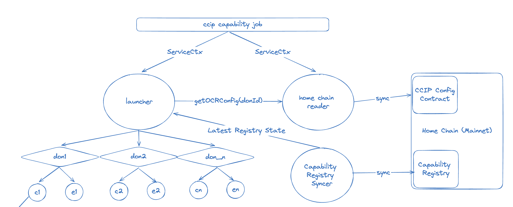
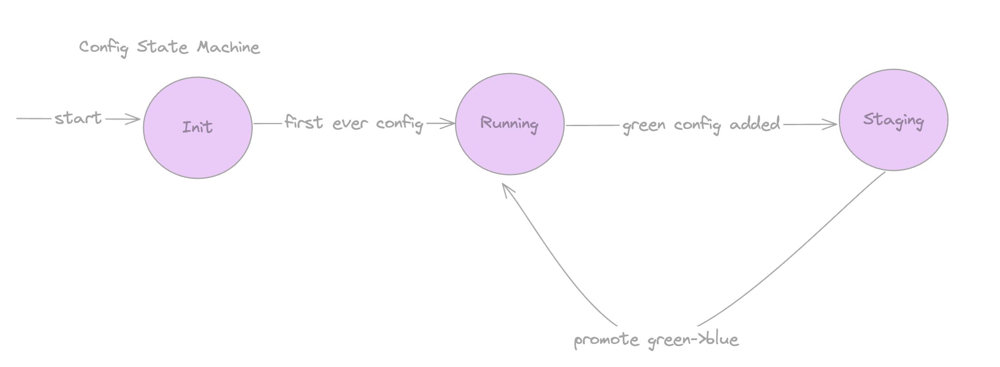

# CCIP Capability Launcher

The CCIP capability launcher is responsible for listening to
[Capabilities Registry](../../../../contracts/src/v0.8/keystone/CapabilitiesRegistry.sol) (CR) updates
for the particular CCIP capability (labelled name, version) pair and reacting to them. In
particular, there are three kinds of events that would affect a particular capability:

1. DON Creation: when `addDON` is called on the CR, the capabilities of this new DON are specified.
If CCIP is one of those capabilities, the launcher will launch a commit and an execution plugin
with the OCR configuration specified in the DON creation process. See
[Types.sol](../../../../contracts/src/v0.8/ccip/capability/libraries/Types.sol) for more details
on what the OCR configuration contains.
2. DON update: when `updateDON` is called on the CR, capabilities of the DON can be updated. In the
CCIP use case specifically, `updateDON` is used to update OCR configuration of that DON. Updates
follow the blue/green deployment pattern (explained in detail below with a state diagram). In this
scenario the launcher must either launch brand new instances of the commit and execution plugins
(in the event a green deployment is made) or promote the currently running green instance to be
the blue instance.
3. DON deletion: when `deleteDON` is called on the CR, the launcher must shut down all running plugins
related to that DON. When a DON is deleted it effectively means that it should no longer function.
DON deletion is permanent.

## Architecture Diagram

The above diagram shows how the CCIP capability launcher interacts with the rest of the components
in the CCIP system.

The CCIP capability job, which is created on the Plugin node, will spin up the CCIP capability
launcher alongside the home chain reader, which reads the [CCIPConfig.sol](../../../../contracts/src/v0.8/ccip/capability/CCIPConfig.sol)
contract deployed on the home chain (typically Ethereum Mainnet, though could be "any chain" in theory).

Injected into the launcher is the [OracleCreator](../types/types.go) object which knows how to spin up CCIP
oracles (both bootstrap and plugin oracles). This is used by the launcher at the appropriate time in order
to create oracle instances but not start them right away.

After all the required oracles have been created, the launcher will start and shut them down as required
in order to match the configuration that was posted on-chain in the CR and the CCIPConfig.sol contract.

## Config State Diagram

CCIP's blue/green deployment paradigm is intentionally kept as simple as possible.

Every CCIP DON starts in the `Init` state. Upon DON creation, which must provide a valid OCR
configuration, the CCIP DON will move into the `Running` state. In this state, the DON is
presumed to be fully functional from a configuration standpoint.

When we want to update configuration, we propose a new configuration to the CR that consists of
an array of two OCR configurations:

1. The first element of the array is the current OCR configuration that is running (termed "blue").
2. The second element of the array is the future OCR configuration that we want to run (termed "green").

Various checks are done on-chain in order to validate this particular state transition, in particular,
related to config counts. Doing this will move the state of the configuration to the `Staging` state.

In the `Staging` state, there are effectively four plugins running - one (commit, execution) pair for the
blue configuration, and one (commit, execution) pair for the green configuration. However, only the blue
configuration will actually be writing on-chain, where as the green configuration will be "dry running",
i.e doing everything except transmitting.

This allows us to test out new configurations without committing to them immediately.

Finally, from the `Staging` state, there is only one transition, which is to promote the green configuration
to be the new blue configuration, and go back into the `Running` state.
