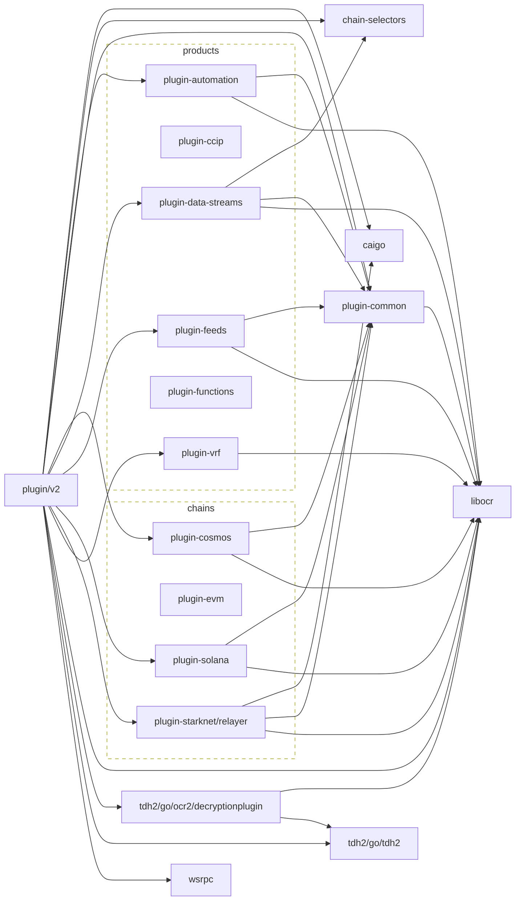

# goplugin Go modules

```mermaid
flowchart LR
  subgraph chains
    plugin-cosmos
    plugin-evm
    plugin-solana
    plugin-starknet/relayer
  end

  subgraph products
    plugin-automation
    plugin-ccip
    plugin-data-streams
    plugin-feeds
    plugin-functions
    plugin-vrf
  end

  classDef outline stroke-dasharray:6,fill:none;
  class chains,products outline

  plugin/v2 --> caigo
  click caigo href "https://github.com/goplugin/caigo"
  plugin/v2 --> chain-selectors
  click chain-selectors href "https://github.com/goplugin/chain-selectors"
  plugin/v2 --> plugin-automation
  click plugin-automation href "https://github.com/goplugin/plugin-automation"
  plugin/v2 --> plugin-common
  click plugin-common href "https://github.com/goplugin/plugin-common"
  plugin/v2 --> plugin-cosmos
  click plugin-cosmos href "https://github.com/goplugin/plugin-cosmos"
  plugin/v2 --> plugin-data-streams
  click plugin-data-streams href "https://github.com/goplugin/plugin-data-streams"
  plugin/v2 --> plugin-feeds
  click plugin-feeds href "https://github.com/goplugin/plugin-feeds"
  plugin/v2 --> plugin-solana
  click plugin-solana href "https://github.com/goplugin/plugin-solana"
  plugin/v2 --> plugin-starknet/relayer
  click plugin-starknet/relayer href "https://github.com/goplugin/plugin-starknet"
  plugin/v2 --> plugin-vrf
  click plugin-vrf href "https://github.com/goplugin/plugin-vrf"
  plugin/v2 --> libocr
  click libocr href "https://github.com/goplugin/plugin-libocr"
  plugin/v2 --> tdh2/go/ocr2/decryptionplugin
  click tdh2/go/ocr2/decryptionplugin href "https://github.com/goplugin/tdh2"
  plugin/v2 --> tdh2/go/tdh2
  click tdh2/go/tdh2 href "https://github.com/goplugin/tdh2"
  plugin/v2 --> wsrpc
  click wsrpc href "https://github.com/goplugin/wsrpc"
  plugin-automation --> plugin-common
  plugin-automation --> libocr
  plugin-common --> libocr
  plugin-cosmos --> plugin-common
  plugin-cosmos --> libocr
  plugin-data-streams --> chain-selectors
  plugin-data-streams --> plugin-common
  plugin-data-streams --> libocr
  plugin-feeds --> plugin-common
  plugin-feeds --> libocr
  plugin-solana --> plugin-common
  plugin-solana --> libocr
  plugin-starknet/relayer --> caigo
  plugin-starknet/relayer --> plugin-common
  plugin-starknet/relayer --> libocr
  plugin-vrf --> libocr
  tdh2/go/ocr2/decryptionplugin --> libocr
  tdh2/go/ocr2/decryptionplugin --> tdh2/go/tdh2
```
